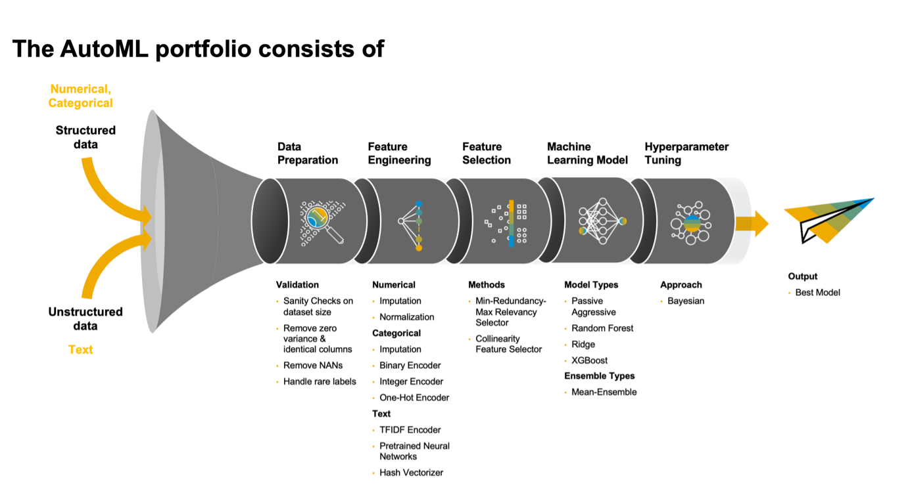
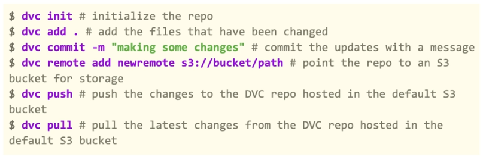
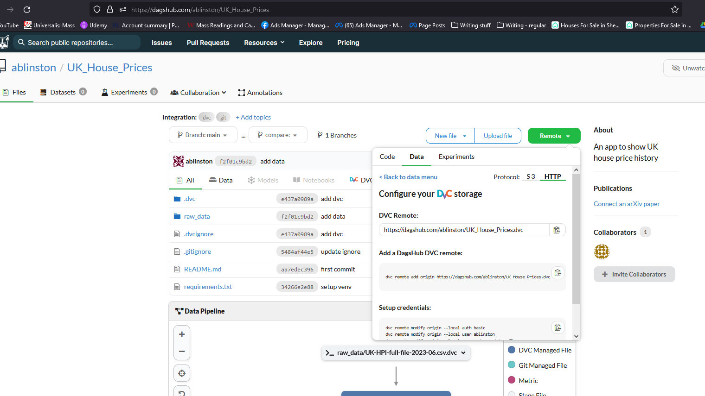
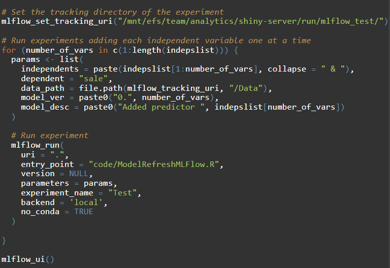
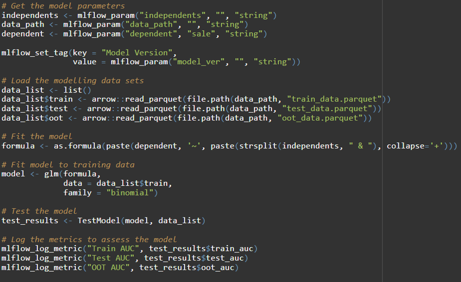

<head><style>
  h1 {margin-top: 50px;}
</style></head>

# AutoML

Automated machine learning is the process of automating the tasks of applying machine learning to real-world problems. It automates things like data cleaning/imputation/validation, feature engineering, training models, model selection and hyper-parameter choices.

`Pycaret` is a library in python that can facilitate this. This link shows which functions to use in order to fit a model. https://pycaret.gitbook.io/docs/get-started/functions#compare_models

`Setup > compare_models > tune_model > finalise_model`




# Cookiecutter

A python library that allows us to install a cookie cutter folder structure for a data science project


# CI/CD (Continuous Integration/Continuous Delivery)

CI/CD automates your builds, testing, and deployment so you can ship code changes faster and more reliably. It’s basically having a dev version where you make and test changes on git which are then pushed to a beta and eventually live and deployed.


# Docker

Docker is an open platform for developing, shipping, and running applications. Docker enables you to separate your applications from your infrastructure so you can deliver software quickly.


# DVC

Data versioning software, very similar to git. It can be run in a git repo alongside git and will store the hashes of datasets to track when they’ve been changed. You would run both together e.g. `dvc push` then `git push` or `dvc pull` then `git pull`.
DVC will push to a remote repo that stores all the historical data, like to an S3 bucket.



(`commit –m` doesn’t seem to work any more, and its now `dvc push –r origin`). The `-r` relate to remote. A full list is given here: `-w|--workspace`, `-a|--all-branches`, `-T|--all-tags` `--all-experiments`, `--all-commits`, `--date` or `--rev` needs to be set.

To use git in conjunction with dvc, you would first checkout a branch using `git checkout master` then you would update the data with `dvc pull`.

Get the code from here.



DVC also has commands to track pipelines of data, what data dependencies there are on other datasets and which scripts are used to generate them. Then you can use the `dvc repro` command and it will detect anything that has changed and run the necessary scripts to update the pipeline.

```
dvc stage add --name train \
                --deps src/model.py \
                --deps data/clean.csv \
                --outs data/predict.dat \
                python src/model.py data/clean.csv
```

or

```
dvc stage add -n train \
                -p train.seed,train.n_est,train.min_split \
                -d src/train.py -d data/features \
                -o model.pkl \
                python src/train.py data/features model.pkl
```
DVC stores lots of data in a cache. Can clean this up with `dvc gc -w`.

# MLFlow

MLflow is an open source platform for managing the end-to-end machine learning lifecycle. It has the following primary components:
* Tracking: Allows you to track experiments to record and compare parameters and results.
Models: Allow you to manage and deploy models from a variety of ML libraries to a variety of model serving and inference platforms.
* Projects: Allow you to package ML code in a reusable, reproducible form to share with other data scientists or transfer to production.
* Model Registry: Allows you to centralize a model store for managing models’ full lifecycle stage transitions: from staging to production, with capabilities for versioning and annotating. Databricks provides a managed version of the Model Registry in Unity Catalog.
* Model Serving: Allows you to host MLflow Models as REST endpoints.

### Code structure

**Run script**
This over-arching code runs the experiments, training and testing different versions of the model. It:
* Sets the tracking URI
* Defines the name of the experiments
* Defines sets of hyperparameters, which are automatically logged with each run
* Runs each experiment
* Loads the MLflow UI (optional)



**Train & Test script**
This code trains and tests a model using a set of hyperparameters passed through by the run script. It:
* Loads data
* Can include feature engineering
* Fits a model with chosen hyperparameters
* Tests the model and calculates required evaluation metrics
* Logs metrics & artifacts



# Packaging in R

Need the following tools

```
install.packages("devtools")
install.packages("roxygen2")
```

The package needs a `DESCRIPTION` file in the root directory. Then documentation and building is done by

```
devtools::document(roclets = c("collate", "rd")) # without affecting the NAMESPACE file
# or
devtools::document()

devtools::build(path = "/loc/package/")
```

# Pre-commit
A python library to check code. Before commiting code to Git, we can use pre-commit add-ons which interrogate the code and check that it is ok, such as `black, flake8, isort, interrogate`.


# PyCharm
Set up a new project, and you can create a new virtual environment to install packages. This is usually named `venv` and works like the renv package in R.

After creating the project, on the left hand side, click Python Console, and here packages can be installed using `pip install package_name`. 

# Renv

Managing package versions in R. To begin, use `renv::init()` then `renv::activate()`.
The install packages with `renv::install("data.table")` and once done use `renv::snapshot()` to save all the versions in the renv.lock file.

# Targets
This is an R package that can set up pipelines. To begin, go to the repo and do `use_targets()`.
This will add a _targets.R file to the directory. In this, you add a pipeline

```
# _targets.R file
library(targets)
source("R/functions.R")
tar_option_set(packages = c("readr", "dplyr", "ggplot2"))
list(
  tar_target(file, "data.csv", format = "file"),
  tar_target(data, get_data(file)),
  tar_target(model, fit_model(data)),
  tar_target(plot, plot_model(model, data))
)
```

All target script files have these requirements.
* Load the packages needed to define the pipeline, e.g. targets itself.2
* Use tar_option_set() to declare the packages that the targets themselves need, as well as other settings such as the default storage format.
* Load your custom functions and small input objects into the R session: in our case, with source("R/functions.R").
* Write the pipeline at the bottom of _targets.R. A pipeline is a list of target objects, which you can create with tar_target(). Each target is a step of the analysis. It looks and feels like a variable in R, but during tar_make(), it will reproducibly store a value in _targets/objects/.

Before running can check the pipeline by running `tar_manifest()`. Can use `tar_visnetwork()` to show it visually, and that will also show what parts are outdated with a lighter colour.

`tar_make()` runs the pipeline. This will detect if anything has changed since the last run of the pipeline and skip parts that don’t need to be run. You can check if anything has changed with `tar_outdated()`

Can then use `tar_read()` or `tar_load()` e.g. `tar_read(plot) #name of the object in the tar_target`.
Various performance options available at https://books.ropensci.org/targets/performance.html


# Unit testing

`testthat` package in R. It works by telling it expectations

There are more than 20 expectations in the testthat package where you can test the results from two values. They try to answer questions like:
```
# Are the values equal, equivalent or identical?
expect_equal(x, y)
expect_equivalent(x, y)
expect_identical(x, y)

# Does the code produce any output/message/warning/error?
expect_output(x, y)
expect_message(x, y)
expect_warning(x, y)
expect_error(x, y)

# How does the returned value compare to a specified value?
expect_lt(x, y)
expect_lte(x, y)
expect_gt(x, y)
expect_gte(x, y)
```


We should have a folder named R with all the R code, and one folder named `tests/testthat`, where all the test scripts will live. For each file with R scripts there should be another one with tests, with the same name, but prefixed by `test_`, as shown:
```
R/my_program.R <=> tests/testthat/test_my_program.R
```
Each of these files should have a test (which can test more than one thing) like this:

```
test_that("Check commutative property", {
    expect_identical(my_good_sum(4, 6), 10)
    expect_identical(my_good_sum(6, 4), 10)
})
```
Can run the whole thing with `devtools::test()`

# Venv
A virtual environment in python, much like renv in R. This creates an environment where you can install packages and track the version types.

* You start by creating the environment `py –3.7 –m venv <directory>`. This will copy the packages already installed on your system. (don’t have to include version number if you don’t want to)
* You then activate it with (Windows) `venv\Scripts\activate.bat`
* Now as long as this is activated, pip will install packages in this virtual environment.
* Once finished, deactivate the environment in case you’re running something else with `deactivate`

Saving to Github: it is standard to do this through a requirements.txt file instead of including the virtualenv itself.

You can easily generate this file with the following: `pip freeze > requirements.txt` You can then install the virtualenv packages on the target machine with: `pip install -r requirements.txt` (after activating the venv!)


# YAML
YAML files contain configuration information from a script and uses indentation like python to set parameters. E.g.
```
apiVersion: v3
kind: Pod
metadata:
	name: rss-site
	labels:
		app: web
```


