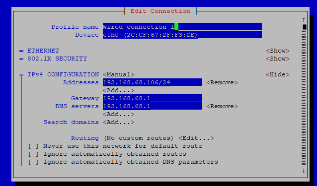

# Access

Access the pi with SSH using PuTTY. Use the IP address of the pi (without the / part) and use port 22. Username and password are in BitWarden.


# IP Address

To set to static IP address on the pi, get the current details with 

```
hostname -I
ip r | grep default
```

Then run `sudo nmtui` and set the connection settings with your pi IP along with a /24, and set the IP of your router for the gateway and DNS.



Can restart the pi with `
sudo shutdown -r now`